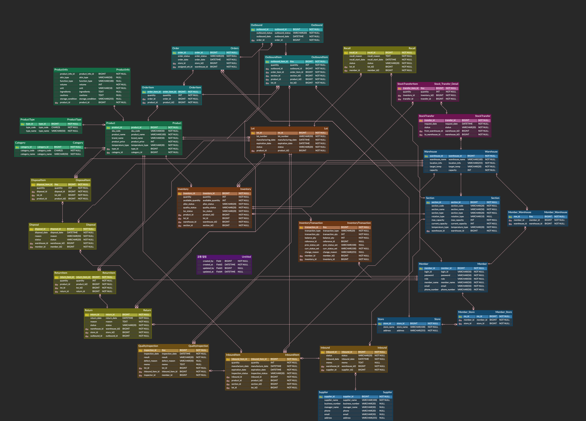

## 프로젝트 소개

본 프로젝트는 화장품 도메인 특유의 민감한 유통기한 관리와 품질 추적의 복잡성을 해결하기 위한 화장품 전용 통합 창고 관리 시스템(WMS) 개발을 목표로 합니다.

단순한 재고 수불 관리를 넘어, 제조 로트(Lot) 단위의 생애 주기를 추적하고 선유통기한 선출고(FEFO) 원칙을 시스템적으로 강제하여 물류 효율과 제품 안전성을 동시에 확보합니다.

<br>

## 프로젝트 목표

- **데이터 정합성 및 무결성 보장:**
    - 재고의 할당·품질·위치라는 3차원 상태 매트릭스를 정의하고, 상태 전이 발생 시마다 조합 유효성을 실시간 검증하여 비논리적인 데이터 발생을 원천 차단합니다.

<br>

- **창고 배정 알고리즘 구축:**
    - SKU별 유통기한 데이터와 가맹점 위치 기반의 지리적 요소를 결합한 가중치 기반 창고 배정 알고리즘을 구현하여 물류 비용 최적화와 FEFO 준수율 극대화를 목표로 합니다.

<br>

- **정교한 트래킹 시스템 구축:**
    - 모든 재고 변동 내역을 Inventory Transaction 테이블에 원자적(Atomic)으로 기록하여, 특정 로트의 결함 발생 시 실시간으로 전사적 출고 금지 및 유통 경로 추적이 가능한 리콜 체계를
      구축합니다.

<br>

## 기술 스택

### Backend

- **Java 21**
- **Spring Boot 3.5.0**
- **Spring Data JPA**
- **Spring Security**

### Database

- **MySQL**

<br>

## ERD



<br>

## 프로젝트 폴더 구조

```
src
├── main
│   ├── java/com/kb/cosmetic_wms
│   │   ├── domain
│   │   │   ├── member                 // 사용자 및 조직 관리
│   │   │   ├── product                // 상품 마스터 관리
│   │   │   ├── inventory              // 재고 및 로트 관리
│   │   │   ├── inbound                // 입고 및 품질 검증
│   │   │   ├── outbound               // 발주 및 출고 관리
│   │   │   └── quality                // 품질 및 사후 관리
│   │   │       ├── controller         // API 엔드포인트
│   │   │       ├── service            // 비즈니스 로직
│   │   │       ├── entity             // 엔티티
│   │   │       ├── repository         // 데이터베이스 접근 인터페이스
│   │   │       └── dto                // 요청/응답 데이터 객체
│   │   │
│   │   ├── global                     // 전역 설정 및 공통 모듈
│   │   │   ├── config
│   │   │   ├── exception
│   │   │   ├── util
│   │   │   └── common
│   │   │
│   │   └── CosmeticWmsApplication.java // Spring Boot 실행 메인 클래스
│   │
│   └── resources
│       ├── application.yml            // 시스템 환경 설정
│       └── mapper/                    // SQL Mapper
│
└── test                               // 테스트 코드 (정합성 및 로직 검증)
    └── java/com/kb/cosmetic_wms
        ├── domain                     // 각 도메인별 단위 및 통합 테스트
        │   ├── inventory
        │   └── outbound               
        └── global                     // 공통 유틸리티 및 설정 테스트
```

<br>

## API 명세

> 추후 작성 예정

<br>

## 실행 방법

> 추후 작성 예정

<br>

## 브랜치 전략 및 컨벤션

### 🌿 브랜치 전략

- **main**: 프로덕션 환경에 배포되는 최상위 브랜치.
- **develop**: 다음 버전을 위한 개발 브랜치. 모든 기능 개발의 통합 지점.
- **feat/[domain name]-[feature name]**: 신규 기능 개발 브랜치. (예: `feat/inventory-fefo-allocation-logic`)
- **fix**: 버그 수정 브랜치. (예: `fix/recall-status-mismatch`)

**Merge 규칙**:

- 모든 기능 개발 브랜치는 `develop` 브랜치에서 분기하며, 개발 완료 후 Pull Request(PR)를 통해 리뷰 후 머지한다.

### 💬 커밋 컨벤션 (Commit Convention)

커밋 메시지는 고유의 의미를 가지도록 `[Type](Scope): [Subject]` 형식을 따른다.

|     Type     | Description                 |
|:------------:|:----------------------------|
|   **feat**   | 새로운 기능 추가                   |
|   **fix**    | 버그 수정 및 데이터 정합성 결함 해결       |
|   **docs**   | 문서 수정 (README, CHANGELOG 등) |
| **refactor** | 코드 리팩토링 (비즈니스 로직 변경 없음)     |
|   **test**   | 테스트 코드 추가 및 수정              |
|  **chore**   | 빌드 업무, 패키지 매니저 설정 등         |

**작성 예시**:

`feat(inventory): 유통기한 기반 FEFO 할당 로직 구현` <br>
`fix(recall): 발생 시 할당된 재고의 강제 취소 로직 수정`
